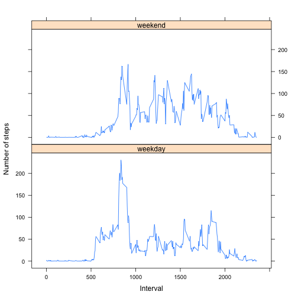

# Reproducible Research: Peer Assessment 1

This assignment makes use of data from a personal activity monitoring device. This device collects data at 5 minute intervals through out the day. The data consists of two months of data from an anonymous individual collected during the months of October and November, 2012 and includes the number of steps taken in 5 minute intervals each day.

## Loading and preprocessing the data

Load the data.

Process/transform the data into a format suitable for analysis.


```r
library(lattice)
activity.df <- read.csv(unz("activity.zip", "activity.csv"))
```

## What is mean total number of steps taken per day?

For now, we can ignore the missing values in the dataset.

Make a histogram of the total number of steps taken each day.


```r
by.date.df <- with(activity.df, aggregate(steps, list(date), sum, na.rm = TRUE))
names(by.date.df) <- c("date", "steps")
with(by.date.df, histogram(steps))
```

 

Calculate and report the mean and median total number of steps taken per day.


```r
mean(by.date.df$steps, na.rm = TRUE)
```

```
## [1] 9354.23
```

```r
median(by.date.df$steps, na.rm = TRUE)
```

```
## [1] 10395
```

There are 8 days with completely missing steps values. Those days have 0 total steps in the histogram lowering the mean and the median.

## What is the average daily activity pattern?

Make a time series plot of the 5-minute interval (x-axis) and the average number of steps taken, averaged across all days (y-axis)


```r
by.interval.df <- with(activity.df, aggregate(steps, list(interval), mean, na.rm = TRUE))
names(by.interval.df) <- c("interval", "steps")
xyplot(steps ~ interval, by.interval.df, type = "l")
```

 

Which 5-minute interval, on average across all the days in the dataset, contains the maximum number of steps?


```r
max.steps <- max(by.interval.df$steps)
by.interval.df[by.interval.df$steps == max.steps, 1]
```

```
## [1] 835
```

## Imputing missing values

There are a number of days/intervals where there are missing step values. The presence of missing data may introduce bias into some calculations or summaries of the data.

Calculate and report the total number of missing values in the dataset.


```r
sum(!complete.cases(activity.df))
```

```
## [1] 2304
```

The strategy for filling in all of the missing step values in the dataset is to use **the mean for that 5-minute interval** because there are 8 days with completely missing steps values.

Create a new dataset that is equal to the original dataset but with the missing data filled in.


```r
completed.df <- merge(activity.df, by.interval.df, by = "interval")
names(completed.df) <- c("interval", "steps", "date", "mean.steps")
completed.df$steps[is.na(completed.df$steps)] = completed.df$mean.steps[is.na(completed.df$steps)]
sum(!complete.cases(completed.df))
```

```
## [1] 0
```

Make a histogram of the total number of steps taken each day.


```r
completed.by.date.df <- with(completed.df, aggregate(steps, list(date), sum))
names(completed.by.date.df) <- c("date", "steps")
with(completed.by.date.df, histogram(steps))
```

 

Calculate and report the mean and median total number of steps taken per day.


```r
mean(completed.by.date.df$steps, na.rm = TRUE)
```

```
## [1] 10766.19
```

```r
median(completed.by.date.df$steps, na.rm = TRUE)
```

```
## [1] 10766.19
```

The values are higher than the estimates from the first part of the assignment. Imputing missing data increases the estimates of the total daily number of steps.

## Are there differences in activity patterns between weekdays and weekends?

Use the dataset with the filled-in missing values for this part.

Create a new factor variable in the dataset with two levels – “weekday” and “weekend” indicating whether a given date is a weekday or weekend day.


```r
completed.df$wday <- (as.POSIXlt(completed.df$date, format="%Y-%m-%d"))$wday
completed.df$wde <- ifelse(completed.df$wday == 0 | completed.df$wday == 6, "weekend", "weekday")
completed.df$wde <- as.factor(completed.df$wde)
```

Make a panel plot containing a time series plot of the 5-minute interval (x-axis) and the average number of steps taken, averaged across all weekday days or weekend days (y-axis).


```r
completed.by.interval.wde <- with(completed.df, aggregate(steps, list(interval, wde), mean))
names(completed.by.interval.wde) <- c("interval", "weekdays", "steps")
xyplot(
	steps ~ interval | weekdays,
	completed.by.interval.wde,
	layout = c(1, 2),
	xlab = "Interval",
	ylab = "Number of steps",
	type = "l"
)
```

 

The weekday data has a big peak around 835 and a lesser one around 1800 interval.
The weekend data is more equally distributed between the daylight intervals.
